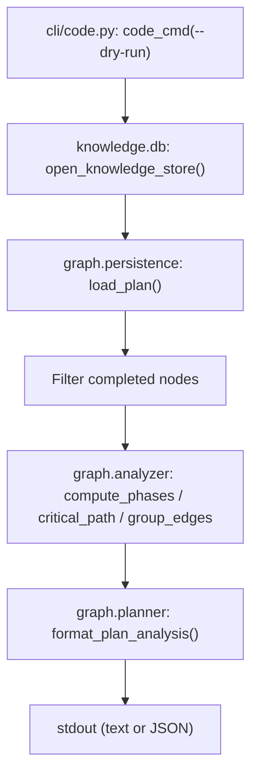

# Design Document: --dry-run Flag on code Command

## Overview

Adds a `--dry-run` flag to the `code` CLI command that loads the persisted plan
from DuckDB, filters out completed nodes, and displays the same rich analysis
(parallelism phases, critical path, dependency edges) already implemented for
`plan --dry-run` in spec 122. The orchestrator is never started. No
infrastructure is set up. No writes occur.

## Architecture



The existing orchestrator path (`run_code()` -> `Orchestrator.run()`) is
completely bypassed.

### Module Responsibilities

1. **`cli/code.py`** -- CLI entry point. Handles `--dry-run` flag, mutual
   exclusion validation, plan loading, completed-node filtering, analysis
   computation, and output formatting. All new logic lives here.
2. **`graph/persistence.py`** -- Provides `load_plan()` to read the persisted
   TaskGraph from DuckDB. No changes needed.
3. **`graph/analyzer.py`** -- Provides `compute_phases()`, `critical_path()`,
   `group_edges()`. No changes needed.
4. **`graph/planner.py`** -- Provides `format_plan_analysis()` and
   `_node_to_dict()` / `_edge_to_dict()` / `_metadata_to_dict()` helpers
   (the latter are in `cli/plan.py`). No changes needed.
5. **`knowledge/db.py`** -- Provides `open_knowledge_store()`. No changes
   needed.

## Execution Paths

### Path 1: code --dry-run (text output)

1. `cli/code.py: code_cmd` -- validates `--dry-run`, checks mutual exclusion
2. `cli/code.py: code_cmd` -- checks DB file exists via `DEFAULT_DB_PATH`
3. `knowledge/db.py: open_knowledge_store(config.knowledge)` -> `KnowledgeDB`
4. `graph/persistence.py: load_plan(conn)` -> `TaskGraph | None`
5. `cli/code.py: code_cmd` -- filters completed nodes from `graph.nodes`,
   `graph.edges`, `graph.order`
6. `graph/analyzer.py: compute_phases(graph)` -> `list[Phase]`
7. `graph/analyzer.py: critical_path(graph)` -> `list[str]`
8. `graph/analyzer.py: group_edges(graph)` -> `GroupedEdges`
9. `spec/discovery.py: discover_specs(specs_path)` -> `list[SpecInfo]`
10. `graph/planner.py: format_plan_analysis(graph, phases, path, grouped, specs)` -> `str`
11. `click.echo(output)` -- side effect: text written to stdout

### Path 2: code --dry-run --json

1. `cli/code.py: code_cmd` -- validates `--dry-run`, checks mutual exclusion
2. `cli/code.py: code_cmd` -- checks DB file exists via `DEFAULT_DB_PATH`
3. `knowledge/db.py: open_knowledge_store(config.knowledge)` -> `KnowledgeDB`
4. `graph/persistence.py: load_plan(conn)` -> `TaskGraph | None`
5. `cli/code.py: code_cmd` -- filters completed nodes
6. `graph/analyzer.py: compute_phases(graph)` -> `list[Phase]`
7. `graph/analyzer.py: critical_path(graph)` -> `list[str]`
8. `graph/analyzer.py: group_edges(graph)` -> `GroupedEdges`
9. `cli/plan.py: _node_to_dict()`, `_edge_to_dict()`, `_metadata_to_dict()` -- serialization helpers
10. `cli/json_io.py: emit(payload)` -- side effect: JSON written to stdout

### Path 3: code --dry-run with incompatible flags

1. `cli/code.py: code_cmd` -- detects `--dry-run` combined with execution flags
2. `click.echo(error_message, err=True)` -- side effect: error to stderr
3. `sys.exit(1)`

## Components and Interfaces

### CLI Flag

```python
@click.option("--dry-run", is_flag=True, default=False,
              help="Show plan analysis without running the orchestrator")
```

### Mutual Exclusion Check

```python
def _check_dry_run_conflicts(
    dry_run: bool,
    parallel: int | None,
    debug: bool,
    watch: bool,
    force_clean: bool,
) -> list[str]:
    """Return list of flag names incompatible with --dry-run, or empty list."""
```

### No New Data Types

All data types are reused from existing modules:
- `TaskGraph`, `Node`, `Edge`, `NodeStatus` from `graph/types.py`
- `Phase`, `GroupedEdges` from `graph/analyzer.py`
- `SpecInfo` from `spec/discovery.py`

## Data Models

No new data models. The feature reads existing DuckDB tables (`plan_nodes`,
`plan_edges`, `plan_meta`) via the existing `load_plan()` function.

## Operational Readiness

- **Observability**: No new logging beyond standard Click output. Debug
  logging follows existing patterns.
- **Rollout**: Feature flag not needed -- `--dry-run` is opt-in.
- **Migration**: No schema changes.

## Correctness Properties

### Property 1: No Orchestrator Invocation

*For any* invocation of `code_cmd` with `dry_run=True`, the system SHALL NOT
call `run_code()` or construct an `Orchestrator` instance.

**Validates: Requirements 1.1, 1.2**

### Property 2: Completed Node Exclusion

*For any* persisted plan loaded during `code --dry-run`, the set of node IDs
in the analysis output SHALL be exactly the set of nodes whose status is not
COMPLETED.

**Validates: Requirements 1.3**

### Property 3: Mutual Exclusion Enforcement

*For any* invocation of `code_cmd` with `dry_run=True` and at least one
execution flag set (`parallel`, `debug`, `watch`, `force_clean`), the system
SHALL exit with code 1 without loading the plan.

**Validates: Requirements 2.1, 2.E1**

### Property 4: Identical Non-Dry-Run Behavior

*For any* invocation of `code_cmd` with `dry_run=False`, the behavior SHALL be
identical to the pre-spec implementation (no regressions).

**Validates: Requirements 1.4**

### Property 5: Read-Only Database Access

*For any* invocation of `code_cmd` with `dry_run=True`, the system SHALL NOT
call `save_plan()`, write to any DuckDB table, or modify any file on disk.

**Validates: Requirements 1.1, 1.2**

### Property 6: Daemon Guard Bypass

*For any* invocation of `code_cmd` with `dry_run=True`, the system SHALL NOT
check the daemon PID file or refuse to run based on daemon state.

**Validates: Requirements 4.1**

## Error Handling

| Error Condition | Behavior | Requirement |
|----------------|----------|-------------|
| DB file missing | Error message mentioning `plan`, exit 1 | 123-REQ-1.E1 |
| Plan empty (no nodes) | Display "No tasks in plan.", exit 0 | 123-REQ-1.E2 |
| All nodes completed | Display "All tasks completed.", exit 0 | 123-REQ-1.E3 |
| Incompatible flags | Error listing flags, exit 1 | 123-REQ-2.1 |
| Multiple incompatible flags | Error listing all flags, exit 1 | 123-REQ-2.E1 |
| Load failure | Error message, exit 1 | 123-REQ-1.E1 |

## Technology Stack

- Python 3.12+
- Click (CLI framework, already used)
- DuckDB (read-only access via existing `load_plan()`)
- Existing `graph.analyzer` and `graph.planner` modules (spec 122)

## Definition of Done

A task group is complete when ALL of the following are true:

1. All subtasks within the group are checked off (`[x]`)
2. All spec tests (`test_spec.md` entries) for the task group pass
3. All property tests for the task group pass
4. All previously passing tests still pass (no regressions)
5. No linter warnings or errors introduced
6. Code is committed on a feature branch and merged into `develop`
7. Feature branch is merged back to `develop`
8. `tasks.md` checkboxes are updated to reflect completion

## Testing Strategy

- **Unit tests**: Test `_check_dry_run_conflicts()` helper directly. Test
  the CLI command via Click's `CliRunner` with mocked `load_plan()` and
  `open_knowledge_store()`.
- **Property tests**: Verify no-orchestrator invariant, completed-node
  exclusion, and mutual exclusion via parameterized inputs.
- **Integration smoke tests**: Invoke `code --dry-run` via `CliRunner` with
  a mock plan containing mixed statuses, verify the output contains expected
  analysis sections.
