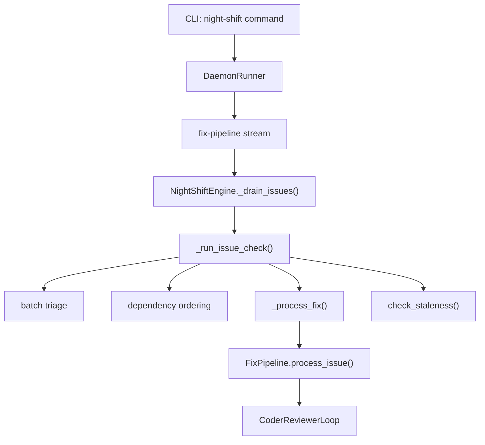

# Design Document: Night-Shift Fix-Only Mode

## Overview

Strip night-shift from a three-stream daemon (hunt + fix + spec-executor) to
a single-stream fix-only daemon. Delete all hunt-scan modules, the
spec-executor stream, unused config fields, related tests, and update
documentation.

## Architecture

After this change, the night-shift architecture simplifies to:



### Module Responsibilities

After deletion, the `agent_fox/nightshift/` package contains:

1. `engine.py` — NightShiftEngine with fix-pipeline business logic only
2. `streams.py` — WorkStream protocol and build_streams() factory (fix-only)
3. `daemon.py` — DaemonRunner lifecycle, scheduling, budget
4. `fix_pipeline.py` — three-stage fix pipeline (triage → coder → reviewer)
5. `coder_reviewer.py` — CoderReviewerLoop for fix sessions
6. `spec_builder.py` — in-memory spec construction from issues
7. `triage.py` — AI batch triage for dependency/supersession detection
8. `dep_graph.py` — dependency graph and topological sort
9. `reference_parser.py` — explicit cross-reference and GitHub relationship parsing
10. `staleness.py` — post-fix staleness detection
11. `cost_helpers.py` — shared AI call wrapper with cost tracking
12. `platform_factory.py` — platform client construction

### Deleted modules

- `hunt.py`, `critic.py`, `dedup.py`, `finding.py`, `ignore_filter.py`,
  `ignore.py`, `categories/` — all hunt-scan infrastructure

## Execution Paths

### Path 1: Fix-pipeline drain loop

```
1. cli/nightshift.py: night_shift_cmd — starts daemon
2. nightshift/daemon.py: DaemonRunner.run — schedules streams
3. nightshift/streams.py: EngineWorkStream.run_once — delegates to engine
4. nightshift/engine.py: NightShiftEngine._drain_issues → bool
5. nightshift/engine.py: NightShiftEngine._run_issue_check
6. nightshift/reference_parser.py: parse_text_references → list[DependencyEdge]
7. nightshift/reference_parser.py: fetch_github_relationships → list[DependencyEdge]
8. nightshift/triage.py: run_batch_triage → TriageResult
9. nightshift/dep_graph.py: build_graph → list[int] (processing order)
10. nightshift/engine.py: NightShiftEngine._process_fix
11. nightshift/fix_pipeline.py: FixPipeline.process_issue → FixMetrics
12. nightshift/staleness.py: check_staleness → StalenessResult
```

## Components and Interfaces

### CLI (simplified)

```python
@click.command("night-shift")
@click.option("--no-fixes", is_flag=True, default=False,
              help="Disable the fix-pipeline stream.")
@click.pass_context
def night_shift_cmd(ctx: click.Context, no_fixes: bool) -> None: ...
```

### build_streams() (simplified)

```python
def build_streams(
    config: object,
    *,
    no_fixes: bool = False,
    engine: object | None = None,
    budget: SharedBudget | None = None,
) -> list[WorkStream]: ...
```

### NightShiftEngine (simplified constructor)

```python
class NightShiftEngine:
    def __init__(
        self,
        config: AgentFoxConfig,
        platform: object,
        *,
        activity_callback: ActivityCallback | None = None,
        task_callback: TaskCallback | None = None,
        status_callback: Callable[[str, str], None] | None = None,
        spinner_callback: SpinnerCallback | None = None,
        sink_dispatcher: SinkDispatcher | None = None,
        conn: duckdb.DuckDBPyConnection | None = None,
    ) -> None: ...
```

### NightShiftConfig (simplified)

```python
class NightShiftConfig(BaseModel):
    model_config = ConfigDict(extra="ignore")
    issue_check_interval: int = Field(default=900)
    push_fix_branch: bool = Field(default=False)
```

## Data Models

No data model changes. The fix pipeline's data models (IssueResult,
FixMetrics, TriageResult, DependencyEdge, StalenessResult) are unchanged.

## Operational Readiness

- **Rollback:** Revert the commit. All deleted modules are in git history.
- **Migration:** Existing config files with removed fields will be silently
  ignored due to `extra="ignore"` on `NightShiftConfig`.
- **Observability:** No changes to audit events or cost tracking.

## Correctness Properties

### Property 1: Fix-pipeline preservation

*For any* set of `af:fix`-labelled issues on the platform, the
night-shift daemon SHALL process them through `_drain_issues()` with the
same behavior as before the change (ordering, triage, staleness, drain
loop, cost/session limits).

**Validates: Requirements 2.4, 3.3**

### Property 2: No dangling imports

*For any* source file in the repository, the file SHALL NOT contain
import statements referencing deleted modules (`hunt`, `critic`, `dedup`,
`finding`, `ignore_filter`, `ignore`, `categories`).

**Validates: Requirements 1.3, 1.E1, 7.2**

### Property 3: Config backward compatibility

*For any* valid config dict containing removed fields (`hunt_scan_interval`,
`categories`, `quality_gate_timeout`, `spec_interval`, `enabled_streams`,
`similarity_threshold`), constructing `NightShiftConfig` from that dict
SHALL succeed without error and SHALL silently discard the removed fields.

**Validates: Requirements 5.1, 5.4**

### Property 4: Single stream output

*For any* call to `build_streams()`, the returned list SHALL contain
exactly one element — the fix-pipeline stream.

**Validates: Requirements 3.3, 3.E1**

### Property 5: CLI flag removal

*For any* invocation of `night-shift` with `--auto`, `--no-specs`,
`--no-hunts`, or `--specs-dir`, the CLI SHALL reject the invocation
with a usage error.

**Validates: Requirements 4.1**

## Error Handling

| Error Condition | Behavior | Requirement |
|----------------|----------|-------------|
| Config file has removed fields | Silently ignored | 125-REQ-5.4 |
| CLI invoked with removed flags | Click usage error | 125-REQ-4.1 |

## Technology Stack

- Python 3.11+
- Click (CLI framework)
- Pydantic v2 (config model, `extra="ignore"`)
- pytest (test framework)

## Definition of Done

A task group is complete when ALL of the following are true:

1. All subtasks within the group are checked off (`[x]`)
2. All spec tests (`test_spec.md` entries) for the task group pass
3. All property tests for the task group pass
4. All previously passing tests still pass (no regressions)
5. No linter warnings or errors introduced
6. Code is committed on a feature branch and merged into `develop`
7. Feature branch is merged back to `develop`
8. `tasks.md` checkboxes are updated to reflect completion

## Testing Strategy

This spec is primarily a deletion and simplification. Tests verify:

1. **Deleted modules are gone** — file-existence checks.
2. **No dangling imports** — import scanning across the codebase.
3. **Config backward compat** — construct NightShiftConfig with removed fields.
4. **build_streams() returns one stream** — unit test.
5. **CLI rejects removed flags** — Click test runner invocations.
6. **Test suite passes** — `make test` with zero failures.
