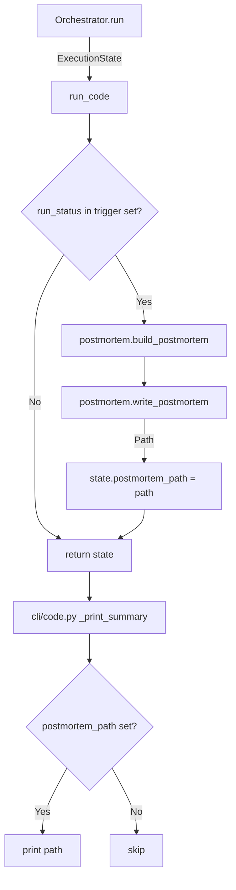

# Design Document: Abort Post-Mortem Dump

## Overview

Adds a post-mortem JSON file dump when `agent-fox code` exits with a
non-successful, non-interrupted status. A new `engine/postmortem.py` module
builds a diagnostic dict from `ExecutionState` and writes it to
`.agent-fox/audit/`. The feature is wired into `engine/run.py` after the
orchestrator returns and before cleanup, with the file path surfaced in the
CLI summary.

## Architecture



### Module Responsibilities

1. **`engine/postmortem.py`** — Post-mortem building and file writing. Pure
   functions with no side effects other than file I/O.
2. **`engine/run.py`** — Orchestration entry point. Calls post-mortem
   generation after the orchestrator returns, before cleanup.
3. **`engine/state.py`** — ExecutionState dataclass. Gains `run_id` and
   `postmortem_path` fields.
4. **`engine/engine.py`** — Orchestrator. Sets `state.run_id` during
   initialization.
5. **`cli/code.py`** — CLI output. Prints post-mortem path when present.

## Execution Paths

### Path 1: Post-mortem generated on non-successful run

1. `engine/engine.py: Orchestrator.run()` — returns `ExecutionState` with
   non-successful `run_status` and populated `run_id`
2. `engine/run.py: run_code()` — receives state, checks `should_dump(state)`
3. `engine/postmortem.py: should_dump(state)` → `bool` (True for trigger
   statuses)
4. `engine/postmortem.py: build_postmortem(state)` → `dict` (the post-mortem
   payload)
5. `engine/postmortem.py: write_postmortem(postmortem, audit_dir)` → `Path`
   (side effect: file written to `.agent-fox/audit/postmortem_{run_id}.json`)
6. `engine/run.py: run_code()` — sets `state.postmortem_path = str(path)`,
   returns state

### Path 2: Post-mortem path displayed in CLI

1. `cli/code.py: code_command()` — receives `ExecutionState` from
   `run_code()`
2. `cli/code.py: _print_summary(state)` — checks `state.postmortem_path`
3. `cli/code.py: _print_summary(state)` — prints
   `"Post-mortem: {state.postmortem_path}"` to stdout (side effect: console
   output)

### Path 3: No post-mortem on successful or interrupted run

1. `engine/engine.py: Orchestrator.run()` — returns `ExecutionState` with
   `run_status = "completed"`
2. `engine/run.py: run_code()` — calls `should_dump(state)` → `False`
3. `engine/run.py: run_code()` — skips post-mortem, returns state with
   empty `postmortem_path`

## Components and Interfaces

### `engine/postmortem.py`

```python
TRIGGER_STATUSES: frozenset[str]
# {"stalled", "block_limit", "cost_limit", "session_limit"}

SCHEMA_VERSION: int  # 1

def should_dump(state: ExecutionState) -> bool:
    """Return True if the run status should trigger a post-mortem."""

def build_postmortem(state: ExecutionState) -> dict[str, Any]:
    """Build a post-mortem dict from an ExecutionState."""

def write_postmortem(
    postmortem: dict[str, Any],
    audit_dir: Path,
) -> Path:
    """Write post-mortem JSON to audit_dir. Returns the file path."""
```

### `engine/state.py` changes

```python
@dataclass
class ExecutionState:
    # ... existing fields ...
    run_id: str = ""             # NEW: orchestrator run identifier
    postmortem_path: str = ""    # NEW: path to post-mortem file (empty if none)
```

### `engine/engine.py` changes

In `Orchestrator._init_run()`, after generating the run_id:
```python
self.state.run_id = self._run_id
```

### `engine/run.py` changes

In `run_code()`, after `state = await orchestrator.run()` and before the
`finally` block:
```python
from agent_fox.engine.postmortem import should_dump, build_postmortem, write_postmortem
if isinstance(state, ExecutionState) and should_dump(state):
    pm = build_postmortem(state)
    pm_path = write_postmortem(pm, AUDIT_DIR)
    state.postmortem_path = str(pm_path)
```

### `cli/code.py` changes

In `_print_summary()`, after printing the status line:
```python
if state.postmortem_path:
    click.echo(f"Post-mortem: {state.postmortem_path}")
```

## Data Models

### Post-mortem JSON schema (v1)

```json
{
  "schema_version": 1,
  "run_id": "20260603_100000_a1b2c3",
  "run_status": "block_limit",
  "started_at": "2026-06-03T10:00:00+00:00",
  "completed_at": "2026-06-03T10:15:00+00:00",
  "task_summary": {
    "total": 10,
    "completed": 3,
    "pending": 1,
    "blocked": 5,
    "failed": 1,
    "in_progress": 0
  },
  "cost_summary": {
    "total_cost_usd": 1.23,
    "total_input_tokens": 100000,
    "total_output_tokens": 50000,
    "total_sessions": 8
  },
  "blocked_tasks": [
    {
      "node_id": "spec_01_group_3",
      "reason": "review-blocking: critical findings (2 critical, 1 major)"
    }
  ],
  "session_history": [
    {
      "node_id": "spec_01_group_3",
      "attempt": 1,
      "status": "completed",
      "archetype": "coder",
      "model": "claude-sonnet-4-6",
      "duration_ms": 45000,
      "cost": 0.15,
      "error_message": null,
      "timestamp": "2026-06-03T10:02:00+00:00",
      "is_transport_error": false,
      "is_budget_exhausted": false,
      "is_non_retryable": false
    }
  ]
}
```

### File naming

`postmortem_{run_id}.json` where `run_id` follows the existing
`{YYYYMMDD}_{HHMMSS}_{hex}` format from `generate_run_id()`.

Example: `postmortem_20260603_100000_a1b2c3.json`

## Operational Readiness

- **Observability**: Post-mortem generation success/failure is logged at
  INFO/WARNING level.
- **Rollout**: No migration needed. The feature writes new files; existing
  audit files are unaffected.
- **Rollback**: Remove the `should_dump()` check in `run_code()` to disable.
- **Compatibility**: The `run_id` and `postmortem_path` fields on
  `ExecutionState` default to empty strings, so existing code that constructs
  or consumes `ExecutionState` is unaffected.

## Correctness Properties

### Property 1: Trigger completeness

*For any* `ExecutionState` with `run_status` in `{stalled, block_limit,
cost_limit, session_limit}`, `should_dump()` SHALL return `True`.

**Validates: Requirements 126-REQ-1.1**

### Property 2: No false triggers

*For any* `ExecutionState` with `run_status` in `{completed, interrupted,
running}`, `should_dump()` SHALL return `False`.

**Validates: Requirements 126-REQ-1.2, 126-REQ-1.3**

### Property 3: Schema completeness

*For any* valid `ExecutionState`, `build_postmortem()` SHALL return a dict
containing all required top-level keys (`schema_version`, `run_id`,
`run_status`, `started_at`, `completed_at`, `task_summary`, `cost_summary`,
`blocked_tasks`, `session_history`) and `schema_version` SHALL equal `1`.

**Validates: Requirements 126-REQ-3.1, 126-REQ-3.2**

### Property 4: Blocked task fidelity

*For any* `ExecutionState` with N tasks in blocked status (in `node_states`),
the `blocked_tasks` array in the post-mortem SHALL have exactly N entries,
each with a non-empty `node_id` and a non-empty `reason`.

**Validates: Requirements 126-REQ-4.1, 126-REQ-4.E1**

### Property 5: Session history fidelity

*For any* `ExecutionState` with K entries in `session_history`, the
post-mortem `session_history` array SHALL have exactly K entries, each
containing all required session fields.

**Validates: Requirements 126-REQ-5.1**

### Property 6: Cost summary accuracy

*For any* `ExecutionState`, the post-mortem `cost_summary` fields SHALL equal
the corresponding `state.total_cost`, `state.total_input_tokens`,
`state.total_output_tokens`, and `state.total_sessions` values.

**Validates: Requirements 126-REQ-5.2**

### Property 7: File round-trip

*For any* post-mortem dict, `write_postmortem()` SHALL produce a file whose
contents, when parsed as JSON, equal the original dict.

**Validates: Requirements 126-REQ-2.2**

### Property 8: Task summary accuracy

*For any* `ExecutionState`, the `task_summary.total` field SHALL equal the
length of `state.node_states`, and the sum of all status counts in
`task_summary` SHALL equal `task_summary.total`.

**Validates: Requirements 126-REQ-3.3**

## Error Handling

| Error Condition | Behavior | Requirement |
|----------------|----------|-------------|
| Post-mortem build raises | Log warning, return state without postmortem_path | 126-REQ-1.E1 |
| File write fails (permission, disk) | Log warning, return state without postmortem_path | 126-REQ-2.E1 |
| Empty run_id on state | Generate fallback run_id from current timestamp | 126-REQ-1.E2 |
| Blocked task has no reason | Use "unknown" as reason string | 126-REQ-4.E1 |
| Empty session history | Write empty arrays and zero cost values | 126-REQ-5.E1 |

## Technology Stack

- Python 3.12+ (dataclasses, pathlib, json stdlib)
- No new dependencies

## Definition of Done

A task group is complete when ALL of the following are true:

1. All subtasks within the group are checked off (`[x]`)
2. All spec tests (`test_spec.md` entries) for the task group pass
3. All property tests for the task group pass
4. All previously passing tests still pass (no regressions)
5. No linter warnings or errors introduced
6. Code is committed on a feature branch and merged into `develop`
7. Feature branch is merged back to `develop`
8. `tasks.md` checkboxes are updated to reflect completion

## Testing Strategy

- **Unit tests** for `should_dump()`, `build_postmortem()`, and
  `write_postmortem()` with representative ExecutionState fixtures.
- **Property tests** (Hypothesis) for schema completeness, blocked task
  fidelity, session history fidelity, and cost summary accuracy across
  randomly generated ExecutionState instances.
- **Integration tests** verifying end-to-end wiring: `run_code()` produces
  a post-mortem file for trigger statuses and does not for COMPLETED /
  INTERRUPTED.
- **Edge case tests** for empty states, missing reasons, write failures.
