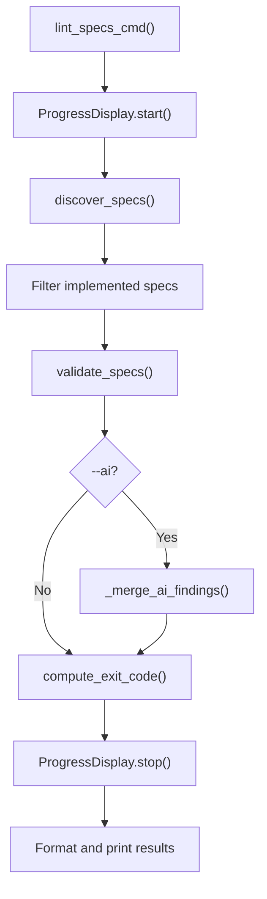

# Design Document: Lint-Specs Cleanup

## Overview

This spec removes auto-fix functionality from `lint-specs`, adds progress
display, and integrates the linter into the af-spec skill workflow. The changes
are subtractive (removing the fixers package and fix-related code paths) plus
two small additions (progress callback, skill template update).

## Architecture

The lint-specs architecture simplifies to a two-phase pipeline:



### Module Responsibilities

1. `agent_fox/cli/lint_specs.py` -- CLI handler: argument parsing, progress
   display setup, output formatting, exit code mapping.
2. `agent_fox/spec/lint.py` -- Backing module: spec discovery, static
   validation orchestration, AI validation merge, progress callback dispatch.
3. `agent_fox/spec/validators/` -- Validation rules (unchanged).
4. `agent_fox/spec/ai_validation.py` -- AI-powered semantic analysis (unchanged).
5. `agent_fox/ui/progress.py` -- Progress display component (reused as-is).

## Execution Paths

### Path 1: lint-specs without --ai

1. `cli/lint_specs.py: lint_specs_cmd()` -- creates ProgressDisplay, calls
   `run_lint_specs()`
2. `spec/lint.py: run_lint_specs(specs_dir, progress_callback=cb)` -- calls
   `discover_specs()`, filters, calls `validate_specs()` -> `list[Finding]`
3. `spec/validators/runner.py: validate_specs()` -> `list[Finding]`
4. `spec/lint.py: compute_exit_code(findings)` -> `int`
5. `cli/lint_specs.py` -- formats and prints findings, exits

### Path 2: lint-specs with --ai

1-3. Same as Path 1
4. `spec/lint.py: _merge_ai_findings(findings, discovered, specs_dir)` -- calls
   `ai_validation.run_ai_validation()` -> merged `list[Finding]`
5. `spec/ai_validation.py: run_ai_validation()` -> `list[Finding]`
6. `spec/lint.py: compute_exit_code(findings)` -> `int`
7. `cli/lint_specs.py` -- formats and prints findings, exits

### Path 3: af-spec skill validation

1. Skill agent writes all 5 spec documents
2. Skill agent runs `agent-fox lint-specs` via Bash tool
3. Skill agent reads output, fixes any errors/warnings
4. Skill agent runs manual completeness checks
5. Skill agent presents spec to user

## Components and Interfaces

### CLI Changes (`lint_specs.py`)

```python
# Removed: --fix option, _format_fix_summary, _git_current_branch,
#          _create_fix_branch, _commit_fixes, run_git_sync import

@click.command("lint-specs")
@click.option("--ai", is_flag=True, default=False, ...)
@click.option("--all", "lint_all", is_flag=True, default=False, ...)
@click.pass_context
def lint_specs_cmd(ctx, ai, lint_all) -> None:
    ...
```

### Backing Module Changes (`lint.py`)

```python
@dataclass(frozen=True)
class LintResult:
    findings: list[Finding] = field(default_factory=list)
    exit_code: int = 0
    # fix_results field removed

def run_lint_specs(
    specs_dir: Path,
    *,
    ai: bool = False,
    lint_all: bool = False,
    progress_callback: Callable[[str], None] | None = None,
) -> LintResult:
    ...
```

### Progress Callback Protocol

The callback receives short phase-level strings:

- `"Discovering specs..."` -- at start
- `"Validating N spec(s)..."` -- before static validation
- `"Running AI analysis..."` -- before AI validation (only with `--ai`)

## Data Models

### LintResult (simplified)

```python
@dataclass(frozen=True)
class LintResult:
    findings: list[Finding] = field(default_factory=list)
    exit_code: int = 0
```

## Execution Paths

(See above.)

## Correctness Properties

### Property 1: Fix code fully removed

*For any* import path in the source tree, the string
`agent_fox.spec.fixers` SHALL NOT appear in any tracked `.py` file.

**Validates: 127-REQ-1.4, 127-REQ-3.2**

### Property 2: CLI rejects --fix

*For any* invocation of `lint_specs_cmd` with `["--fix"]` arguments, Click
SHALL return a non-zero exit code.

**Validates: 127-REQ-1.1, 127-REQ-1.E1**

### Property 3: LintResult has no fix_results

*For any* `LintResult` instance, the object SHALL NOT have a `fix_results`
attribute.

**Validates: 127-REQ-1.3**

### Property 4: Progress callback is optional

*For any* call to `run_lint_specs()` without a `progress_callback` argument,
the function SHALL return a valid `LintResult` identical to a call with
`progress_callback=None`.

**Validates: 127-REQ-4.2, 127-REQ-4.E1**

## Error Handling

| Error Condition | Behavior | Requirement |
|----------------|----------|-------------|
| `--fix` flag provided | Click rejects as unrecognized option | 127-REQ-1.E1 |
| No specs directory | `PlanError` raised | (existing) |
| AI validation failure | Warning logged, static findings returned | (existing) |
| Progress callback is None | No progress messages emitted, linting proceeds normally | 127-REQ-4.E1 |

## Operational Readiness

No new operational concerns. The progress display reuses existing
infrastructure (`ProgressDisplay`). Removing the fixers package reduces the
surface area.

## Technology Stack

- Python 3.12+
- Click (CLI framework)
- Rich (terminal UI, via ProgressDisplay)
- Existing `agent_fox.ui.progress.ProgressDisplay`

## Definition of Done

A task group is complete when ALL of the following are true:

1. All subtasks within the group are checked off (`[x]`)
2. All spec tests (`test_spec.md` entries) for the task group pass
3. All property tests for the task group pass
4. All previously passing tests still pass (no regressions)
5. No linter warnings or errors introduced
6. Code is committed on a feature branch and merged into `develop`
7. Feature branch is merged back to `develop`
8. `tasks.md` checkboxes are updated to reflect completion

## Testing Strategy

- **Unit tests** verify CLI flag rejection, LintResult structure, progress
  callback invocation, and absence of fix-related code.
- **Property tests** verify fix code removal (grep-based), CLI rejection, and
  callback optionality.
- **Integration smoke tests** run `lint_specs_cmd` end-to-end via CliRunner
  to verify the complete pipeline works without fix code.
