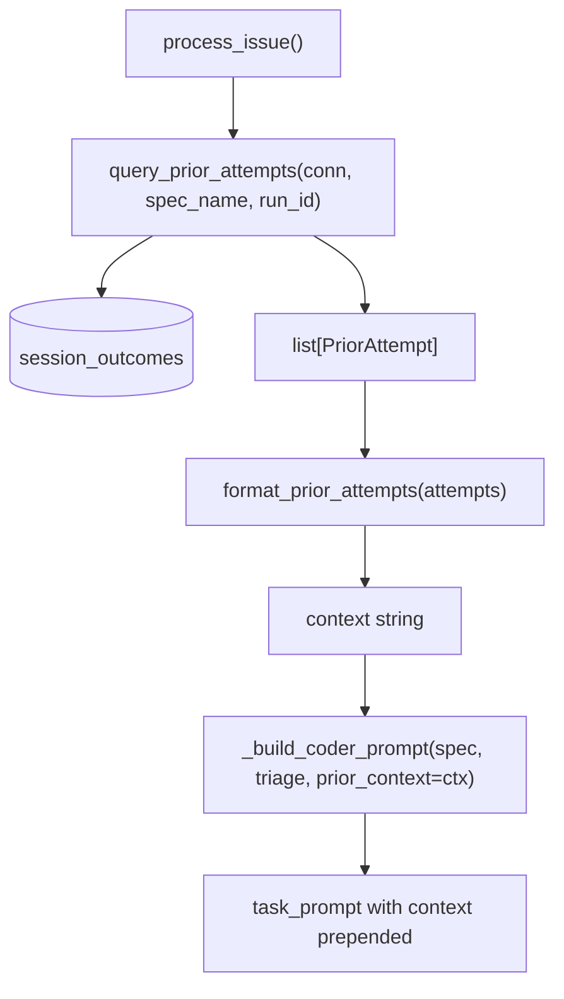

# Design Document: Night-Shift Prior Attempt Context

## Overview

Adds a query-format-inject pipeline that retrieves prior fix attempt records
from the existing `session_outcomes` table and injects them into the coder's
task prompt. No new tables or migrations. Two new functions (query + format)
and two call-site changes (pipeline + prompt builder).

## Architecture



### Module Responsibilities

1. `agent_fox/nightshift/prior_attempts.py` (new) -- Query function and
   `PriorAttempt` dataclass. Format function for rendering context markdown.
2. `agent_fox/nightshift/fix_pipeline.py` (modified) -- Calls query before
   coder-reviewer loop, passes result to prompt builder.

## Execution Paths

### Path 1: Fix with prior attempts

1. `nightshift/fix_pipeline.py: FixPipeline.process_issue(issue)` -- starts fix
2. `nightshift/fix_pipeline.py: FixPipeline.process_issue` -- calls
   `query_prior_attempts(conn, spec_name, run_id)` -> `list[PriorAttempt]`
3. `nightshift/prior_attempts.py: query_prior_attempts()` -- queries
   `session_outcomes` table -> `list[PriorAttempt]`
4. `nightshift/prior_attempts.py: format_prior_attempts(attempts)` -> `str`
5. `nightshift/fix_pipeline.py: _build_coder_prompt(spec, triage, prior_context=ctx)` ->
   `(system_prompt, task_prompt)` with context prepended
6. Coder session receives the enriched prompt

### Path 2: Fix without prior attempts (first attempt)

1-3. Same as Path 1, but query returns empty list
4. `format_prior_attempts([])` -> `""`
5. `_build_coder_prompt(spec, triage, prior_context="")` -> unchanged prompt
6. Coder session receives the original prompt (no behavioral change)

### Path 3: Query failure (fail-open)

1-2. Same as Path 1
3. `query_prior_attempts()` catches exception, logs warning -> `[]`
4-6. Same as Path 2 (falls through to empty context)

## Components and Interfaces

### New Module: `prior_attempts.py`

```python
@dataclass(frozen=True)
class PriorAttempt:
    run_id: str
    created_at: str
    status: str
    error_message: str | None
    model: str | None

def query_prior_attempts(
    conn: duckdb.DuckDBPyConnection,
    spec_name: str,
    current_run_id: str,
    max_results: int = 3,
) -> list[PriorAttempt]:
    """Query prior coder sessions for the given issue, grouped by run."""

def format_prior_attempts(attempts: list[PriorAttempt]) -> str:
    """Format prior attempts as a markdown context block."""
```

### Modified: `fix_pipeline.py`

```python
# In _build_coder_prompt():
def _build_coder_prompt(
    self,
    spec: InMemorySpec,
    triage: TriageResult,
    review_feedback: FixReviewResult | None = None,
    prior_context: str = "",  # NEW
) -> tuple[str, str]:

# In process_issue() or coder_reviewer_loop():
prior = query_prior_attempts(self._conn, spec_name, self._run_id)
prior_context = format_prior_attempts(prior)
# ... pass prior_context to _build_coder_prompt()
```

## Data Models

### PriorAttempt Dataclass

```python
@dataclass(frozen=True)
class PriorAttempt:
    run_id: str           # e.g. "20260528_143022_a1b2c3"
    created_at: str       # ISO 8601 timestamp
    status: str           # "completed" | "failed" | "timeout"
    error_message: str | None  # truncated to 500 chars
    model: str | None     # e.g. "claude-sonnet-4-5-20250514"
```

### SQL Query

```sql
WITH ranked AS (
    SELECT run_id, created_at, status, error_message, model,
           ROW_NUMBER() OVER (
               PARTITION BY run_id
               ORDER BY created_at DESC
           ) AS rn
    FROM session_outcomes
    WHERE spec_name = ?
      AND archetype = 'coder'
      AND run_id != ?
)
SELECT run_id, created_at, status, error_message, model
FROM ranked
WHERE rn = 1
ORDER BY created_at DESC
LIMIT ?
```

### Formatted Output Example

```markdown
## Prior Fix Attempts

1. **2026-05-28** (failed, claude-sonnet-4-5-20250514): Merge conflict in
   parser.py — the fix modified lines that had been changed on develop since
   the issue was filed.
2. **2026-05-25** (failed, claude-sonnet-4-5-20250514): Tests still failing
   after fix — the root cause was in the tokenizer, not the parser.
3. **2026-05-22** (completed, claude-sonnet-4-5-20250514): No error recorded.
```

## Correctness Properties

### Property 1: Current run excluded

*For any* call to `query_prior_attempts(conn, spec_name, run_id)`, the
returned list SHALL NOT contain any `PriorAttempt` whose `run_id` equals the
`current_run_id` argument.

**Validates: 128-REQ-1.1, 128-REQ-4.2**

### Property 2: One entry per run

*For any* non-empty result from `query_prior_attempts()`, all `run_id` values
in the returned list SHALL be distinct.

**Validates: 128-REQ-1.2**

### Property 3: Result bounded

*For any* call to `query_prior_attempts()` with `max_results=N`, the returned
list SHALL have length <= N.

**Validates: 128-REQ-1.2**

### Property 4: Empty input produces empty output

*For any* call to `format_prior_attempts([])`, the return value SHALL be the
empty string `""`.

**Validates: 128-REQ-2.3, 128-REQ-3.2**

### Property 5: Fail-open on query error

*For any* exception raised during the database query in
`query_prior_attempts()`, the function SHALL catch the exception, log a
warning, and return an empty list.

**Validates: 128-REQ-1.E2**

## Error Handling

| Error Condition | Behavior | Requirement |
|----------------|----------|-------------|
| No prior sessions exist | Return empty list | 128-REQ-1.E1 |
| Database query fails | Log warning, return empty list | 128-REQ-1.E2 |
| `session_outcomes` table missing | Caught by query error handler | 128-REQ-1.E2 |
| Error message exceeds 500 chars | Truncated with `...` marker | 128-REQ-2.2 |

## Technology Stack

- Python 3.12+
- DuckDB (existing `session_outcomes` table)
- No new dependencies

## Definition of Done

A task group is complete when ALL of the following are true:

1. All subtasks within the group are checked off (`[x]`)
2. All spec tests (`test_spec.md` entries) for the task group pass
3. All property tests for the task group pass
4. All previously passing tests still pass (no regressions)
5. No linter warnings or errors introduced
6. Code is committed on a feature branch and merged into `develop`
7. Feature branch is merged back to `develop`
8. `tasks.md` checkboxes are updated to reflect completion

## Testing Strategy

- **Unit tests** verify the query function with a real in-memory DuckDB
  connection (insert test data, query, assert results).
- **Unit tests** verify the format function with various inputs (empty, single,
  multiple, long error messages).
- **Property tests** verify invariants: current run exclusion, one-per-run
  grouping, result bounding, empty-in-empty-out.
- **Integration smoke test** verifies the full pipeline from `process_issue()`
  through to the enriched prompt, using a mock platform and real DuckDB.
