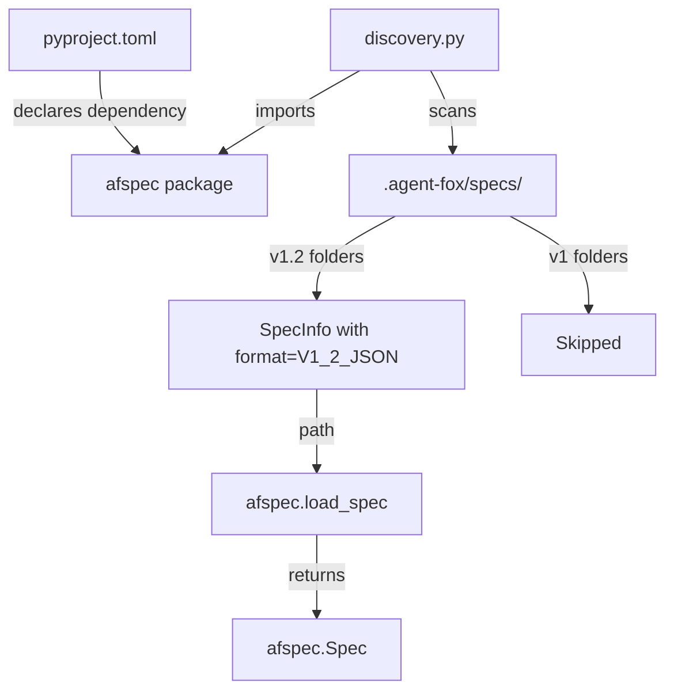

# Design Document: afspec Library Integration

## Overview

This spec adds `afspec` as a dependency and updates the spec discovery module
to detect v1.2 format specs. The change is localized to `pyproject.toml` and
`agent_fox/spec/discovery.py`.

## Architecture



### Module Responsibilities

1. `pyproject.toml` — declares the `afspec` path dependency.
2. `agent_fox/spec/discovery.py` — discovers spec folders, detects format,
   filters to v1.2 only.
3. `afspec` (external) — provides `load_spec()`, models, validation, rendering.

## Execution Paths

### Path 1: Spec discovery filters to v1.2

1. `agent_fox/graph/planner.py: build_plan()` — calls `discover_specs()`
2. `agent_fox/spec/discovery.py: discover_specs()` — scans `.agent-fox/specs/`,
   detects format per folder, returns only `V1_2_JSON` specs as `list[SpecInfo]`

### Path 2: afspec loads a discovered spec

1. `agent_fox/spec/discovery.py: discover_specs()` — returns `SpecInfo` with
   `path` and `format=V1_2_JSON`
2. `afspec.io: load_spec(spec_info.path)` → `afspec.Spec` with all artifacts

## Components and Interfaces

### SpecFormat Enum

```python
class SpecFormat(Enum):
    V1_MARKDOWN = "v1_markdown"
    V1_2_JSON = "v1_2_json"
```

### Updated SpecInfo

```python
@dataclass
class SpecInfo:
    name: str           # folder name, e.g. "132_afspec_integration"
    prefix: int         # numeric prefix for sorting
    path: Path          # absolute path to spec folder
    has_tasks: bool     # True if tasks.json exists
    has_prd: bool       # True if prd.md exists
    format: SpecFormat  # V1_MARKDOWN or V1_2_JSON
```

### Format Detection Logic

```python
def _detect_format(spec_dir: Path) -> SpecFormat:
    if (spec_dir / "requirements.json").is_file():
        return SpecFormat.V1_2_JSON
    return SpecFormat.V1_MARKDOWN
```

### Updated discover_specs

The function changes:
1. After detecting format, skip `V1_MARKDOWN` specs.
2. For `V1_2_JSON` specs, check `tasks.json` instead of `tasks.md`.
3. `has_prd` still checks for `prd.md` (same filename in both formats).

## Correctness Properties

### Property 1: Format detection is deterministic

*For any* spec folder on disk, the format detection function SHALL return
the same `SpecFormat` value on every invocation, determined solely by the
presence of `requirements.json`.

**Validates: Requirements 3.1, 3.2**

### Property 2: Discovery excludes v1 specs

*For any* set of spec folders containing a mix of v1 and v1.2 formats,
`discover_specs()` SHALL return only those with `SpecFormat.V1_2_JSON`.

**Validates: Requirements 3.3**

### Property 3: afspec load succeeds for valid v1.2 specs

*For any* valid v1.2 spec folder (containing `prd.md` with frontmatter,
`requirements.json`, `test_spec.json`, `tasks.json`), `afspec.load_spec()`
SHALL return a `Spec` with all four artifacts populated.

**Validates: Requirements 4.1**

## Error Handling

| Error Condition | Behavior | Requirement |
|----------------|----------|-------------|
| afspec package not importable | ImportError at module load time | 132-REQ-1.E1 |
| Spec folder has neither requirements file | Skipped silently during discovery | 132-REQ-2.E1 |
| Malformed JSON in spec artifact | afspec.LoadError raised | 132-REQ-4.E1 |

## Technology Stack

- Python 3.12+
- `afspec` package (from af-core, local path dependency)
- Pydantic 2.x (transitive via afspec)
- PyYAML (transitive via afspec)

## Definition of Done

A task group is complete when ALL of the following are true:

1. All subtasks within the group are checked off (`[x]`)
2. All spec tests (`test_spec.md` entries) for the task group pass
3. All property tests for the task group pass
4. All previously passing tests still pass (no regressions)
5. No linter warnings or errors introduced
6. Code is committed on a feature branch and merged into `develop`
7. `tasks.md` checkboxes are updated to reflect completion

## Testing Strategy

Unit tests verify format detection logic with fixture directories. Property
tests use Hypothesis to generate combinations of spec files and confirm
detection is deterministic. Integration tests verify afspec can load specs
found by discovery.
