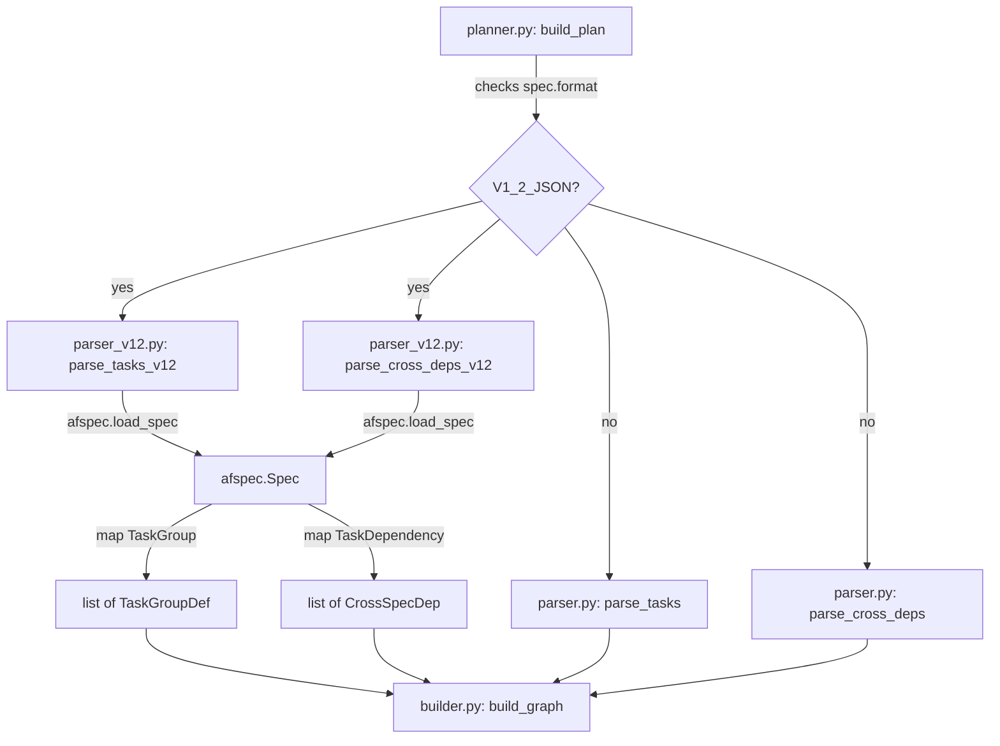

# Design Document: v1.2 Parsing Pipeline

## Overview

This spec adds `agent_fox/spec/parser_v12.py` with mapper functions that
convert afspec Pydantic models to the existing agent-fox dataclasses, and
updates the planner to route v1.2 specs through the new parser. The graph
builder remains unchanged.

## Architecture



### Module Responsibilities

1. `agent_fox/spec/parser_v12.py` — loads v1.2 specs via afspec and maps
   Pydantic models to agent-fox dataclasses.
2. `agent_fox/graph/planner.py` — routes spec parsing based on
   `SpecInfo.format`.
3. `agent_fox/graph/builder.py` — unchanged; consumes `TaskGroupDef` and
   `CrossSpecDep` as before.

## Execution Paths

### Path 1: v1.2 task group parsing

1. `planner.py: build_plan()` — iterates discovered specs
2. For a spec with `format == V1_2_JSON` and `has_tasks == True`:
   calls `parser_v12.parse_tasks_v12(spec.path)`
3. `parser_v12.parse_tasks_v12()` — calls `afspec.load_spec(spec_dir)`
4. Iterates `spec.tasks.groups`, calls `_map_task_group()` for each
5. `_map_task_group()` — calls `_map_subtask()` for each subtask,
   computes `completed` status, renders `body`
6. Returns `list[TaskGroupDef]` to planner

### Path 2: v1.2 cross-spec dependency parsing

1. `planner.py: build_plan()` — iterates discovered specs
2. For a spec with `format == V1_2_JSON` and `has_prd == True`:
   calls `parser_v12.parse_cross_deps_v12(spec.path, spec_name=spec.name)`
3. `parser_v12.parse_cross_deps_v12()` — calls `afspec.load_spec(spec_dir)`
4. Iterates `spec.tasks.dependencies`, calls `_map_dependency()` for each
5. Returns `list[CrossSpecDep]` to planner

### Path 3: Planner format routing

1. `planner.py: build_plan()` — calls `discover_specs()` (returns only
   v1.2 specs per spec 132)
2. For each spec, checks `spec.format`:
   - `V1_2_JSON` → calls `parse_tasks_v12()` and `parse_cross_deps_v12()`
   - (v1 specs are already filtered out by discovery per spec 132)
3. Passes unified `task_groups` dict and `cross_deps` list to `build_graph()`

## Components and Interfaces

### parser_v12.py Public API

```python
def parse_tasks_v12(spec_dir: Path) -> list[TaskGroupDef]:
    """Load a v1.2 spec and return task groups as TaskGroupDef list."""

def parse_cross_deps_v12(
    spec_dir: Path,
    spec_name: str,
) -> list[CrossSpecDep]:
    """Load a v1.2 spec and return cross-spec dependencies."""
```

### Internal Mapper Functions

```python
def _map_subtask(subtask: afspec.Subtask) -> SubtaskDef:
    """Map one afspec Subtask to one SubtaskDef."""

def _map_task_group(group: afspec.TaskGroup) -> TaskGroupDef:
    """Map one afspec TaskGroup to one TaskGroupDef."""

def _map_dependency(
    dep: afspec.TaskDependency,
    current_spec: str,
) -> CrossSpecDep:
    """Map one afspec TaskDependency to one CrossSpecDep."""

def _render_group_body(group: afspec.TaskGroup) -> str:
    """Render a task group as markdown body text."""
```

### Mapping Details

```
afspec.Subtask          -> SubtaskDef
  .id                   -> .id
  .title                -> .title
  .state == DONE        -> .completed

afspec.TaskGroup        -> TaskGroupDef
  .id                   -> .number
  .title                -> .title
  False                 -> .optional       (v1.2 has no optional groups)
  all_non_dropped_done  -> .completed
  _render_group_body()  -> .body
  None                  -> .archetype      (v1.2 has no archetype tags)

afspec.TaskDependency   -> CrossSpecDep
  .depends_on_spec      -> .from_spec
  .to_group             -> .from_group
  current_spec          -> .to_spec
  .from_group           -> .to_group
```

### Updated planner.py build_plan()

```python
# In the spec iteration loop:
from agent_fox.spec.discovery import SpecFormat

for spec in specs:
    if not spec.has_tasks:
        continue

    if spec.format == SpecFormat.V1_2_JSON:
        groups = parse_tasks_v12(spec.path)
        if groups:
            task_groups[spec.name] = groups
        if spec.has_prd:
            deps = parse_cross_deps_v12(spec.path, spec_name=spec.name)
            cross_deps.extend(deps)
    else:
        # Existing v1 markdown path (retained for compatibility)
        tasks_path = spec.path / "tasks.md"
        groups = parse_tasks(tasks_path)
        if groups:
            task_groups[spec.name] = groups
        if spec.has_prd:
            prd_path = spec.path / "prd.md"
            deps = parse_cross_deps(prd_path, spec_name=spec.name)
            cross_deps.extend(deps)
```

## Correctness Properties

### Property 1: Subtask completion mapping is a bijection on state

*For any* `Subtask` with `state == SubtaskState.DONE`, the mapped
`SubtaskDef.completed` SHALL be `True`. *For any* `Subtask` with any
other state, `completed` SHALL be `False`.

**Validates: Requirements 1.1, 1.2**

### Property 2: Group completion is consistent with subtask states

*For any* `TaskGroup`, `TaskGroupDef.completed` SHALL be `True` if and
only if every non-dropped subtask has `state == SubtaskState.DONE`.

**Validates: Requirements 2.2, 2.3, 2.E1**

### Property 3: Output types are format-invariant

*For any* v1.2 spec, `parse_tasks_v12()` SHALL return `list[TaskGroupDef]`
and `parse_cross_deps_v12()` SHALL return `list[CrossSpecDep]` — the same
types returned by the markdown parser. The graph builder receives identical
type signatures regardless of source format.

**Validates: Requirements 4.1, 4.2**

## Error Handling

| Error Condition | Behavior | Requirement |
|----------------|----------|-------------|
| afspec.load_spec raises LoadError | Propagated uncaught to caller | 133-REQ-4.E1 |
| TaskGroup has no subtasks | Returns TaskGroupDef with empty subtasks tuple, completed=True | 133-REQ-2.E1 |
| Spec has no dependencies | parse_cross_deps_v12 returns empty list | 133-REQ-3.E1 |

## Technology Stack

- Python 3.12+
- `afspec` package (from af-core, local path dependency via spec 132)
- `agent_fox.spec.parser` (existing dataclasses — imported, not modified)

## Definition of Done

A task group is complete when ALL of the following are true:

1. All subtasks within the group are checked off (`[x]`)
2. All spec tests (`test_spec.md` entries) for the task group pass
3. All property tests for the task group pass
4. All previously passing tests still pass (no regressions)
5. No linter warnings or errors introduced
6. Code is committed on a feature branch and merged into `develop`
7. `tasks.md` checkboxes are updated to reflect completion

## Testing Strategy

Unit tests verify each mapper function in isolation using hand-constructed
afspec model instances. Property tests use Hypothesis to generate subtask
states and verify completion mapping invariants. Integration tests verify
that planner routing produces correct task groups from v1.2 fixture specs.
A smoke test exercises the full pipeline from discovery through planner
to graph builder output.
