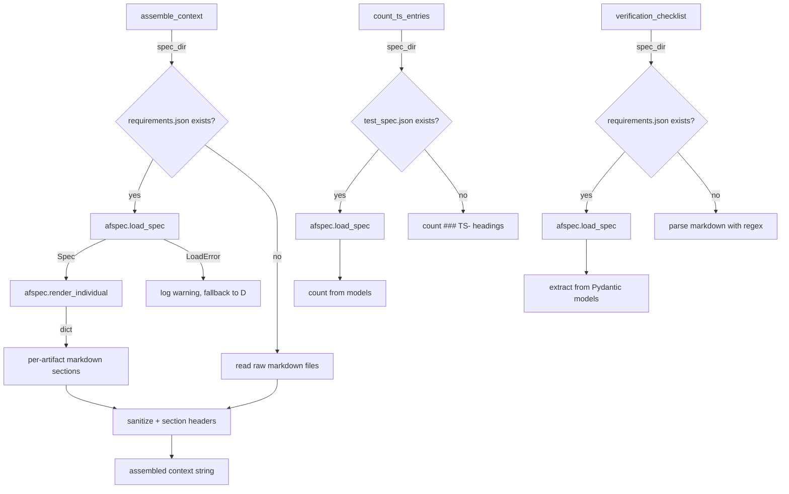

# Design Document: v1.2 Context Assembly and Rendering

## Overview

This spec updates three modules to support v1.2 JSON spec rendering: the
context assembly pipeline (`agent_fox/session/context.py`), the graph spec
helpers (`agent_fox/graph/spec_helpers.py`), and the verification checklist
builder (`agent_fox/spec/verification_checklist.py`). Each module gains a
format detection branch that routes to afspec-based loading and rendering
when the spec folder is v1.2.

## Architecture



### Module Responsibilities

1. **`agent_fox/session/context.py`** — context assembly with v1.2 branch.
   - Detects v1.2 via `requirements.json` presence.
   - Loads spec via `afspec.load_spec()`, renders via `render_individual()`.
   - Falls back to raw markdown reads on `LoadError`.
   - Reads `architecture.md` from disk (replaces `design.md`).

2. **`agent_fox/graph/spec_helpers.py`** — test count and oracle gating.
   - `count_ts_entries()` detects `test_spec.json` and counts via models.
   - `spec_has_existing_code()` checks `architecture.md` for v1.2 specs.

3. **`agent_fox/spec/verification_checklist.py`** — structured audit.
   - `_audit_task_checkboxes()` loads `tasks.json` via afspec.
   - `scan_requirement_test_coverage()` extracts IDs from `requirements.json`.

## Execution Paths

### Path 1: v1.2 context assembly (happy path)

1. `assemble_context(spec_dir, ...)` is called.
2. `(spec_dir / "requirements.json").is_file()` returns True.
3. `afspec.load_spec(spec_dir)` returns a populated `Spec` object.
4. `afspec.render_individual(spec)` returns a dict with keys
   `"prd"`, `"requirements"`, `"test_spec"`, `"tasks"`.
5. Each non-empty rendered artifact is wrapped in a section header and
   added to `file_sections`.
6. If `architecture.md` exists, it is read from disk and added under
   "## Architecture".
7. The rest of the assembly (DB findings, steering, memory, prior
   groups, verification checklist) proceeds unchanged.

### Path 2: v1.2 context assembly with LoadError fallback

1. Steps 1-2 same as Path 1.
2. `afspec.load_spec(spec_dir)` raises `afspec.LoadError`.
3. A warning is logged with the error details.
4. Assembly falls through to the existing v1 markdown reading path
   (reads whatever `.md` files exist in the folder).

### Path 3: v1 context assembly (unchanged)

1. `assemble_context(spec_dir, ...)` is called.
2. `(spec_dir / "requirements.json").is_file()` returns False.
3. The existing `_CORE_SPEC_FILES` loop reads `requirements.md`,
   `design.md`, `test_spec.md`, `tasks.md` from disk.
4. Assembly proceeds exactly as before.

### Path 4: v1.2 test count via spec helpers

1. `count_ts_entries(spec_dir)` is called.
2. `(spec_dir / "test_spec.json").is_file()` returns True.
3. `afspec.load_spec(spec_dir)` returns a `Spec` with a populated
   `test_spec` field.
4. Count = len(test_cases) + len(property_tests) + len(edge_case_tests)
   + len(smoke_tests).

### Path 5: v1.2 verification checklist

1. `build_verification_checklist(spec_dir, ...)` is called.
2. `_audit_task_checkboxes(spec_dir)` detects `tasks.json` and loads
   via afspec. Extracts subtask state from `TaskGroup.subtasks`.
3. `scan_requirement_test_coverage(spec_dir, ...)` detects
   `requirements.json` and loads via afspec. Extracts requirement IDs
   from `Requirements.requirements[*].id`.

## Components and Interfaces

### Updated _CORE_SPEC_FILES constant

The existing constant remains unchanged for v1 compatibility. A new
mapping provides the v1.2 artifact-to-header correspondence:

```python
_V12_SECTION_HEADERS: dict[str, str] = {
    "requirements": "## Requirements",
    "test_spec": "## Test Specification",
    "tasks": "## Tasks",
}
```

### v1.2 Detection Helper

```python
def _is_v12_spec(spec_dir: Path) -> bool:
    return (spec_dir / "requirements.json").is_file()
```

### v1.2 Rendering Function

```python
def _render_v12_sections(spec_dir: Path) -> list[str]:
    """Load a v1.2 spec and render per-artifact markdown sections.

    Returns a list of rendered section strings. Raises afspec.LoadError
    on malformed specs (caller handles fallback).
    """
    import afspec

    spec = afspec.load_spec(spec_dir)
    rendered = afspec.render_individual(spec)

    sections = []
    for key, header in _V12_SECTION_HEADERS.items():
        content = rendered.get(key, "")
        if content:
            safe = sanitize_prompt_content(content, label="spec")
            sections.append(f"{header}\n\n{safe}")

    # architecture.md is a plain markdown file in v1.2
    arch_path = spec_dir / "architecture.md"
    if arch_path.is_file():
        arch_content = arch_path.read_text(encoding="utf-8")
        safe = sanitize_prompt_content(arch_content, label="spec")
        sections.append(f"## Architecture\n\n{safe}")

    return sections
```

### Updated count_ts_entries

```python
def count_ts_entries(spec_dir: Path) -> int:
    test_spec_json = spec_dir / "test_spec.json"
    if test_spec_json.is_file():
        try:
            import afspec
            spec = afspec.load_spec(spec_dir)
            ts = spec.test_spec
            return (
                len(ts.test_cases)
                + len(ts.property_tests)
                + len(ts.edge_case_tests)
                + len(ts.smoke_tests)
            )
        except Exception:
            logger.warning("Failed to load test_spec.json in %s", spec_dir)
            return 0

    # v1 fallback: count ### TS- headings
    test_spec_md = spec_dir / "test_spec.md"
    if not test_spec_md.exists():
        return 0
    count = 0
    for line in test_spec_md.read_text().splitlines():
        if line.strip().startswith("### TS-"):
            count += 1
    return count
```

### Updated spec_has_existing_code

```python
def spec_has_existing_code(spec_path: Path) -> bool:
    # v1.2: check architecture.md instead of design.md
    if (spec_path / "requirements.json").is_file():
        target = spec_path / "architecture.md"
    else:
        target = spec_path / "design.md"

    try:
        content = target.read_text(encoding="utf-8")
    except OSError:
        return True  # safe default

    refs = _DESIGN_FILE_REF.findall(content)
    if not refs:
        return False
    for ref in refs:
        if Path(ref).exists():
            return True
    return False
```

### Updated _audit_task_checkboxes

```python
def _audit_task_checkboxes(spec_dir: Path) -> list[SubtaskAuditEntry]:
    if (spec_dir / "tasks.json").is_file():
        return _audit_task_checkboxes_v12(spec_dir)
    return _audit_task_checkboxes_v1(spec_dir)
```

The v1.2 variant loads `tasks.json` via `afspec.load_spec()` and maps
`TaskGroup.subtasks` to `SubtaskAuditEntry` objects, using
`Subtask.state` (an enum: `pending`, `done`, `skipped`, `blocked`) to
set `checked` and `skipped` fields.

### Updated scan_requirement_test_coverage

```python
def scan_requirement_test_coverage(
    spec_dir: Path,
    tests_dir: Path | None = None,
) -> list[RequirementMapping]:
    if (spec_dir / "requirements.json").is_file():
        return _scan_req_coverage_v12(spec_dir, tests_dir)
    return _scan_req_coverage_v1(spec_dir, tests_dir)
```

The v1.2 variant loads `requirements.json` via `afspec.load_spec()` and
extracts requirement IDs from `Requirements.requirements[*].id` instead
of using regex on markdown text.

## Correctness Properties

### Property 1: v1.2 rendering produces equivalent section structure

*For any* valid v1.2 spec folder, the assembled context SHALL contain
sections with headers "## Requirements", "## Test Specification", and
"## Tasks" in the same relative order as the v1 rendering path.

**Validates: Requirements 2.1**

### Property 2: v1 path is completely unchanged

*For any* spec folder without `requirements.json`, the assembled context
SHALL be byte-identical to what the pre-change code would produce.

**Validates: Requirements 1.2**

### Property 3: Test count consistency

*For any* valid v1.2 spec folder, `count_ts_entries()` SHALL return a
count equal to the sum of all test entry lists in the afspec `TestSpec`
model.

**Validates: Requirements 3.1**

## Error Handling

| Error Condition | Behavior | Requirement |
|----------------|----------|-------------|
| afspec.LoadError during context assembly | Log warning, fall back to raw markdown reads | 134-REQ-1.E1 |
| render_individual returns empty artifact | Omit that section silently | 134-REQ-2.E1 |
| test_spec.json load failure in count_ts_entries | Return 0, log warning | 134-REQ-3.E1 |
| tasks.json load failure in checklist | Return empty list, log warning | 134-REQ-4.E1 |
| requirements.json load failure in checklist | Return empty list, log warning | 134-REQ-4.E1 |

## Technology Stack

- Python 3.12+
- `afspec` package (from af-core, local path dependency via spec 132)
- Pydantic 2.x (transitive via afspec)
- DuckDB (existing dependency for findings/errata queries)

## Definition of Done

A task group is complete when ALL of the following are true:

1. All subtasks within the group are checked off (`[x]`)
2. All spec tests (`test_spec.md` entries) for the task group pass
3. All property tests for the task group pass
4. All previously passing tests still pass (no regressions)
5. No linter warnings or errors introduced
6. Code is committed on a feature branch and merged into `develop`
7. `tasks.md` checkboxes are updated to reflect completion

## Testing Strategy

Unit tests use temporary directories with fixture v1.2 spec files (valid
JSON artifacts) and v1 spec files (markdown). Integration tests verify
end-to-end context assembly with both formats. Property tests confirm
v1 path invariance and section structure consistency. Mocking is used
for DuckDB connections; afspec loading uses real fixture files.
