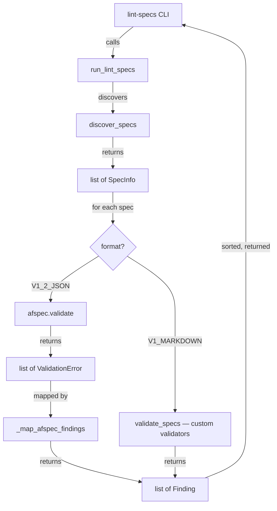

# Design Document: v1.2 Skill Template and Validation Migration

## Overview

This spec touches two modules and one template file. The backing lint module
(`agent_fox/spec/lint.py`) gains format-aware routing that dispatches v1.2
specs to `afspec.validate()` while v1 specs continue through the existing
custom validators. A mapping function translates `afspec.ValidationError`
instances to the existing `Finding` dataclass. The af-spec skill template
(`agent_fox/_templates/skills/af-spec`) is rewritten to instruct agents to
produce v1.2 artifacts.

## Architecture



### Module Responsibilities

1. `agent_fox/spec/lint.py` -- orchestrates format detection and routing,
   calls `afspec.validate()` for v1.2 specs, maps results to `Finding`.
2. `agent_fox/cli/lint_specs.py` -- CLI handler, unchanged except for
   possible import additions.
3. `agent_fox/spec/validators/` -- custom validators for v1 markdown specs,
   unchanged.
4. `agent_fox/_templates/skills/af-spec` -- skill template, rewritten for
   v1.2 artifact production.

## Execution Paths

### Path 1: lint-specs validates a v1.2 spec

1. `agent_fox/cli/lint_specs.py: lint_specs_cmd()` -- parses CLI args, calls
   `run_lint_specs()`
2. `agent_fox/spec/lint.py: run_lint_specs()` -- discovers specs via
   `discover_specs()`, iterates over results
3. `agent_fox/spec/lint.py: run_lint_specs()` -- for each spec with
   `format == V1_2_JSON`, calls `_validate_v12_spec(spec)` ->
   `list[Finding]`
4. `agent_fox/spec/lint.py: _validate_v12_spec()` -- calls
   `afspec.validate(spec.path)` -> `list[ValidationError]`
5. `agent_fox/spec/lint.py: _map_afspec_findings(spec.name, errors)` ->
   `list[Finding]` -- maps each `ValidationError` to a `Finding`
6. `agent_fox/spec/lint.py: run_lint_specs()` -- merges findings from all
   specs, sorts, returns `LintResult`

### Path 2: lint-specs validates a v1 markdown spec

1. `agent_fox/cli/lint_specs.py: lint_specs_cmd()` -- parses CLI args, calls
   `run_lint_specs()`
2. `agent_fox/spec/lint.py: run_lint_specs()` -- discovers specs, collects
   v1 specs into a separate list
3. `agent_fox/spec/lint.py: run_lint_specs()` -- calls
   `validate_specs(specs_dir, v1_specs)` -> `list[Finding]`
4. `agent_fox/spec/lint.py: run_lint_specs()` -- merges with v1.2 findings,
   sorts, returns `LintResult`

### Path 3: lint-specs validates a mixed set

1. Same as Path 1 steps 1-2
2. `agent_fox/spec/lint.py: run_lint_specs()` -- partitions specs by format
3. Runs Path 1 steps 3-5 for v1.2 specs
4. Runs Path 2 step 3 for v1 specs
5. Merges both finding lists, sorts, returns `LintResult`

## Components and Interfaces

### New Functions in lint.py

```python
def _validate_v12_spec(spec: SpecInfo) -> list[Finding]:
    """Validate a v1.2 spec using afspec.validate().

    Catches exceptions and returns a single error Finding on failure.
    """

def _map_afspec_findings(
    spec_name: str,
    errors: list[afspec.ValidationError],
) -> list[Finding]:
    """Map afspec ValidationError instances to Finding instances."""
```

### afspec.validate() Interface (External)

```python
# From the afspec library (spec 132 dependency)
def validate(spec_dir: Path) -> list[ValidationError]:
    """Run schema validation and cross-file integrity checks.

    Returns a list of ValidationError instances. Empty list means valid.
    """

@dataclass
class ValidationError:
    file: str       # e.g., "requirements.json"
    rule: str       # e.g., "schema-error", "missing-field"
    severity: str   # "error" | "warning" | "hint"
    message: str    # Human-readable description
    line: int | None  # Source line number, if available
```

### Updated run_lint_specs Flow

The existing `run_lint_specs()` function changes from:

```python
findings = validate_specs(specs_dir, discovered)
```

To:

```python
# Partition by format
v1_specs = [s for s in discovered if s.format == SpecFormat.V1_MARKDOWN]
v12_specs = [s for s in discovered if s.format == SpecFormat.V1_2_JSON]

findings: list[Finding] = []

# Validate v1 specs with custom validators
if v1_specs:
    findings.extend(validate_specs(specs_dir, v1_specs))

# Validate v1.2 specs with afspec
for spec in v12_specs:
    findings.extend(_validate_v12_spec(spec))
```

## Correctness Properties

### Property 1: Format routing is exhaustive

*For any* spec in the discovered list, the system SHALL validate it using
exactly one validator -- `validate_specs()` for `V1_MARKDOWN` or
`afspec.validate()` for `V1_2_JSON` -- and never skip a spec or validate it
with both.

**Validates: Requirements 1.1, 1.2, 1.3**

### Property 2: Finding mapping preserves fields

*For any* `ValidationError` returned by `afspec.validate()`, the mapped
`Finding` SHALL have identical `file`, `rule`, `message`, and `line` values,
with `spec_name` set to the spec's folder name and `severity` mapped to the
matching `Finding` severity constant.

**Validates: Requirements 2.1, 2.2**

### Property 3: CLI output is format-agnostic

*For any* set of `Finding` instances (whether originating from custom
validators or `afspec.validate()`), the CLI SHALL produce identical output
format (table or JSON) without exposing which validator produced the finding.

**Validates: Requirements 3.1, 3.2**

### Property 4: Skill template produces valid v1.2 artifacts

*For any* spec produced by following the af-spec skill template instructions,
the resulting spec folder SHALL pass `afspec.validate()` without errors.

**Validates: Requirements 4.1, 4.2, 4.3, 6.1, 6.2**

## Error Handling

| Error Condition | Behavior | Requirement |
|----------------|----------|-------------|
| afspec.validate() raises exception | Emit error Finding with rule `afspec-error`, continue | 135-REQ-1.E1 |
| ValidationError has unknown severity | Default to `error` severity | 135-REQ-2.2 |
| afspec.validate() returns empty list | Zero findings for that spec | 135-REQ-2.E1 |
| No v1.2 specs discovered | Skip afspec validation, run only custom validators | 135-REQ-1.2 |
| No v1 specs discovered | Skip custom validators, run only afspec validation | 135-REQ-1.1 |

## Technology Stack

- Python 3.12+
- `afspec` package (from af-core, local path dependency via spec 132)
- Click (CLI framework, existing)
- Existing `Finding` dataclass and severity constants

## Definition of Done

A task group is complete when ALL of the following are true:

1. All subtasks within the group are checked off (`[x]`)
2. All spec tests (`test_spec.md` entries) for the task group pass
3. All property tests for the task group pass
4. All previously passing tests still pass (no regressions)
5. No linter warnings or errors introduced
6. Code is committed on a feature branch and merged into `develop`
7. `tasks.md` checkboxes are updated to reflect completion

## Testing Strategy

Unit tests verify the mapping function and format routing logic using mock
`ValidationError` instances and fixture spec directories. Property tests use
Hypothesis to generate arbitrary `ValidationError` fields and confirm the
mapping preserves all values. Integration smoke tests run `run_lint_specs()`
against a temp directory with both v1 and v1.2 specs. The skill template is
tested by verifying its content includes the required v1.2 artifact names,
ID formats, and JSON structure references.
