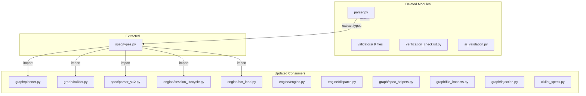

# Design Document: Remove Legacy Markdown Spec Format Code

## Overview

This spec is a pure cleanup: extract shared types, delete ~1,300 lines of
legacy code across 12 files, rewire imports in ~12 consumer files, remove
stale constants, and verify the test suite passes. No new features.

## Architecture



### Module Responsibilities

1. `agent_fox/spec/types.py` — **New.** Holds `TaskGroupDef`, `SubtaskDef`,
   `CrossSpecDep` dataclasses extracted from the deleted `parser.py`.
2. `agent_fox/spec/parser_v12.py` — **Existing (spec 133).** The JSON-based
   parser that replaces the deleted markdown parser.
3. All consumer modules — **Updated.** Import from `spec.types` instead of
   `spec.parser`; use `parser_v12` instead of `parse_tasks`/`parse_cross_deps`.

## Execution Paths

### Path 1: Type import after extraction

1. `agent_fox/graph/builder.py` — imports `TaskGroupDef` from
   `agent_fox.spec.types`
2. Python import machinery resolves `agent_fox/spec/types.py`
3. `TaskGroupDef` is the same dataclass previously in `parser.py`

### Path 2: Attempting import from deleted module

1. Any module attempts `from agent_fox.spec.parser import parse_tasks`
2. Python raises `ImportError` — `agent_fox.spec.parser` does not exist
3. Error is immediately visible; no silent fallback

### Path 3: lint-specs after validator deletion

1. `agent_fox/cli/lint_specs.py` — invokes lint-specs
2. Calls afspec validation (wired in spec 135)
3. Does NOT reference `agent_fox.spec.validators` — module does not exist

## Components and Interfaces

### agent_fox/spec/types.py

```python
from dataclasses import dataclass

@dataclass
class SubtaskDef:
    id: str
    title: str
    completed: bool
    optional: bool

@dataclass
class TaskGroupDef:
    number: int
    title: str
    optional: bool
    completed: bool
    subtasks: list[SubtaskDef]
    body: str
    archetype: str | None

@dataclass
class CrossSpecDep:
    from_spec: str
    from_group: int
    to_spec: str
    to_group: int
    relationship: str
```

### Deletion Manifest

Files to `git rm`:

```
agent_fox/spec/parser.py
agent_fox/spec/validators/__init__.py
agent_fox/spec/validators/_helpers.py
agent_fox/spec/validators/files.py
agent_fox/spec/validators/tasks.py
agent_fox/spec/validators/requirements.py
agent_fox/spec/validators/dependencies.py
agent_fox/spec/validators/schema.py
agent_fox/spec/validators/traceability.py
agent_fox/spec/validators/runner.py
agent_fox/spec/verification_checklist.py
agent_fox/spec/ai_validation.py
```

## Correctness Properties

### Property 1: Import substitutability

*For any* consumer module that previously imported `TaskGroupDef`,
`SubtaskDef`, or `CrossSpecDep` from `parser.py`, the system SHALL
provide the identical class from `types.py` with no behavioral difference.

**Validates: Requirements 1.1, 1.2**

### Property 2: No dangling imports

*For any* Python module in the `agent_fox/` package, the system SHALL
not contain an import statement referencing a deleted module
(`agent_fox.spec.parser`, `agent_fox.spec.validators`,
`agent_fox.spec.verification_checklist`, `agent_fox.spec.ai_validation`).

**Validates: Requirements 2.1, 3.1, 4.1, 4.2, 4.3, 4.4**

### Property 3: Zero old-format filename references

*For any* Python source file in `agent_fox/` (excluding `fix/spec_gen.py`),
the file SHALL not contain string literals `"requirements.md"`,
`"design.md"`, or `"test_spec.md"` that reference spec artifact filenames.

**Validates: Requirements 5.2**

## Error Handling

| Error Condition | Behavior | Requirement |
|----------------|----------|-------------|
| Import from deleted parser.py | ImportError raised | 136-REQ-1.E1 |
| Import from deleted validators/ | ImportError raised | 136-REQ-4.E1 |
| Test referencing deleted module | Test updated or deleted | 136-REQ-2.E1 |
| Finding class still needed | Extracted before deletion | 136-REQ-3.E1 |
| fix/spec_gen.py old references | Left intact (out of scope) | 136-REQ-5.E1 |

## Technology Stack

- Python 3.12+
- git (for file deletion tracking)
- grep (for reference scanning)
- pytest (for test verification)

## Definition of Done

A task group is complete when ALL of the following are true:

1. All subtasks within the group are checked off (`[x]`)
2. All spec tests (`test_spec.md` entries) for the task group pass
3. All property tests for the task group pass
4. All previously passing tests still pass (no regressions)
5. No linter warnings or errors introduced
6. Code is committed on a feature branch and merged into `develop`
7. `tasks.md` checkboxes are updated to reflect completion

## Testing Strategy

This is a deletion-heavy spec. Tests primarily verify:
- The extracted types module works correctly (unit tests)
- No import errors exist after deletion (import smoke tests)
- No stale references remain (grep-based verification)
- The full test suite passes after cleanup
