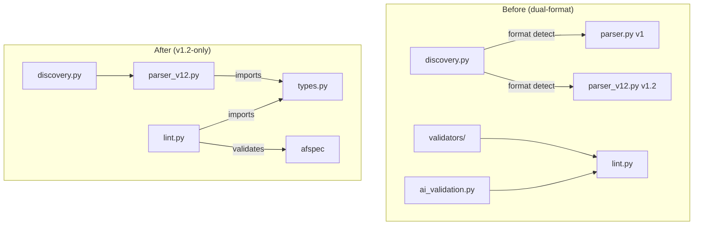

# Design Document: Legacy Format Removal

## Overview

This spec is primarily a deletion and rewiring operation. The architecture
does not change — the v1.2 pipeline already exists and works. The work is:
extract shared types, rewire imports, delete v1 modules, update tests,
remove format-routing conditionals, and update docs.

## Architecture

The change affects the spec layer and its consumers:

### Module Responsibilities

1. **`spec/types.py`** (new) — Canonical home for shared frozen dataclasses
   (`TaskGroupDef`, `SubtaskDef`, `CrossSpecDep`) and validation types
   (`Finding`, severity constants, `compute_exit_code`, `sort_findings`).
2. **`spec/parser_v12.py`** (modified) — Imports from `types.py` instead of
   `parser.py`. No functional change.
3. **`spec/discovery.py`** (simplified) — Removes `V1_MARKDOWN` from
   `SpecFormat` enum, simplifies `_detect_format()`, and removes v1
   filtering from `discover_specs()`.
4. **`spec/lint.py`** (simplified) — Removes v1 validation path and
   `validators` imports. Only the `_validate_v12_spec()` path remains.
5. **`spec/verification_checklist.py`** (simplified) — Strips v1 code paths.
   Only the `_audit_task_checkboxes_v12()` and `_scan_req_coverage_v12()`
   paths remain.
6. **`session/context.py`** (simplified) — Removes `_CORE_SPEC_FILES`,
   removes v1 file-reading path. Only the afspec rendering path remains.
7. **`spec/_patterns.py`** (simplified) — Removes `extract_test_spec_ids()`
   and `test_spec.md` reference. Keeps `REQ_ID_BARE` and other shared
   patterns used by `verification_checklist.py`.

## Execution Paths

### Path 1: Lint validates a v1.2 spec

1. `cli/lint_specs.py` — user runs `agent-fox lint-specs`
2. `spec/lint.py: run_lint_specs()` — discovers specs, filters implemented
3. `spec/lint.py: _validate_v12_spec()` — calls `afspec.validate()`
4. `spec/lint.py: _map_afspec_findings()` — maps to `Finding` from `types.py`
5. `spec/types.py: compute_exit_code()` — determines exit code

### Path 2: Planner parses a v1.2 spec

1. `graph/planner.py` — planner receives spec
2. `spec/parser_v12.py: parse_tasks_v12()` — loads tasks.json via afspec
3. `spec/types.py: TaskGroupDef` — returned to planner
4. `graph/builder.py` — builds task graph from `TaskGroupDef` list

### Path 3: Context assembles a v1.2 spec

1. `session/context.py` — engine prepares session context
2. `afspec.load_spec()` — loads JSON artifacts
3. `afspec.render_individual()` — renders to markdown
4. `spec/verification_checklist.py` — extracts checklist from afspec models

## Components and Interfaces

### `spec/types.py` (new module)

Exports:
- `TaskGroupDef` — frozen dataclass (number, title, optional, completed,
  subtasks, body, archetype)
- `SubtaskDef` — frozen dataclass (id, title, completed)
- `CrossSpecDep` — frozen dataclass (from_spec, from_group, to_spec, to_group)
- `Finding` — dataclass (file, line, rule, message, severity)
- `SEVERITY_ERROR`, `SEVERITY_WARNING`, `SEVERITY_HINT` — string constants
- `compute_exit_code(findings)` — returns 0 if no errors, 1 otherwise
- `sort_findings(findings)` — sorts by severity then file then line

### Files deleted

| File/Directory | Reason |
|---|---|
| `agent_fox/spec/parser.py` | v1 markdown parser — superseded by `parser_v12.py` |
| `agent_fox/spec/validators/` | v1 validation rules — superseded by `afspec.validate()` |
| `agent_fox/spec/ai_validation.py` | v1 AI validation — no v1.2 equivalent |

### Files modified (import rewiring)

| File | Change |
|---|---|
| `spec/parser_v12.py` | Import from `spec.types` instead of `spec.parser` |
| `graph/builder.py` | Import from `spec.types` instead of `spec.parser` |
| `graph/planner.py` | Import from `spec.types`, remove v1 parse calls, remove format routing |
| `graph/spec_helpers.py` | Remove v1 branches (design.md, test_spec.md references) |
| `graph/file_impacts.py` | Update to reference `architecture.md` instead of `design.md` |
| `graph/injection.py` | Update `requirements.md` check to `requirements.json` in `build_review_only_graph()` |
| `engine/session_lifecycle.py` | Replace `parse_tasks` with `parse_tasks_v12`, adapt `extract_subtask_descriptions()` to use `TaskGroupDef.body` |
| `engine/hot_load.py` | Replace `EXPECTED_FILES`/`validate_specs` with v1.2 equivalents, import `Finding` from `spec.types` |
| `engine/engine.py` | Replace `parse_tasks` with `parse_tasks_v12` |
| `engine/dispatch.py` | Replace `parse_tasks` with `parse_tasks_v12` |
| `spec/lint.py` | Remove v1 validation path, import from `spec.types` |
| `cli/lint_specs.py` | Import from `spec.types` instead of `spec.validators` |
| `session/context.py` | Remove `_CORE_SPEC_FILES`, remove v1 path |
| `spec/discovery.py` | Remove `V1_MARKDOWN` from enum, simplify `_detect_format()` and `discover_specs()` |
| `spec/verification_checklist.py` | Strip v1 code paths |
| `spec/_patterns.py` | Remove `extract_test_spec_ids()` and `test_spec.md` reference |

### Test files deleted

| File | Reason |
|---|---|
| `tests/unit/spec/test_parser.py` | Tests v1 parser |
| `tests/unit/spec/test_validator.py` | Tests v1 validators |
| `tests/unit/spec/test_validator_coverage_gaps.py` | Tests v1 validators |
| `tests/unit/spec/test_validator_plan_rules.py` | Tests v1 validators |
| `tests/unit/spec/test_validator_robustness_rules.py` | Tests v1 validators |
| `tests/unit/spec/test_ai_validator.py` | Tests v1 AI validation |
| `tests/unit/spec/test_stale_dependency.py` | Tests v1 stale dependency validation |

### Test files with import updates

~11 test files that import `TaskGroupDef`, `SubtaskDef`, or `CrossSpecDep`
from `agent_fox.spec.parser` need their import changed to
`agent_fox.spec.types`. Tests importing `Finding` or severity constants from
`agent_fox.spec.validators` need their import changed to
`agent_fox.spec.types`. Tests asserting `V1_MARKDOWN` existence
(`test_132_afspec_integration.py`) need updating.

## Correctness Properties

### Property 1: Type identity preserved

*For any* consumer module that previously imported `TaskGroupDef` from
`parser.py`, the `TaskGroupDef` from `types.py` SHALL have identical field
names, types, and frozen behavior.

**Validates: Requirements 1.1, 1.3**

### Property 2: Full package importability

*For any* Python module in `agent_fox/`, importing the module SHALL NOT raise
`ImportError`. No dangling references to deleted modules may exist.

**Validates: Requirements 2.2, 3.1, 4.1, 5.1-5.4**

### Property 3: No v1 filename strings in source

*For any* Python file in `agent_fox/` (excluding `fix/spec_gen.py`), the file
SHALL NOT contain the strings `requirements.md`, `design.md`, or
`test_spec.md` as operational code (non-comment, non-docstring-history
references).

**Validates: Requirements 6.4**

## Error Handling

| Error Condition | Behavior | Requirement |
|---|---|---|
| Import from deleted `parser.py` | Python raises `ImportError` | 137-REQ-1.E1 |
| Import from deleted `validators/` | Python raises `ImportError` | 137-REQ-3.E1 |
| Spec directory lacks `requirements.json` | `discover_specs()` excludes it | 137-REQ-6.E1 |

## Definition of Done

A task group is complete when ALL of the following are true:

1. All subtasks within the group are checked off (`[x]`)
2. All spec tests (`test_spec.md` entries) for the task group pass
3. All property tests for the task group pass
4. All previously passing tests still pass (no regressions)
5. No linter warnings or errors introduced
6. Code is committed on a feature branch and merged into `develop`
7. `tasks.md` checkboxes are updated to reflect completion
